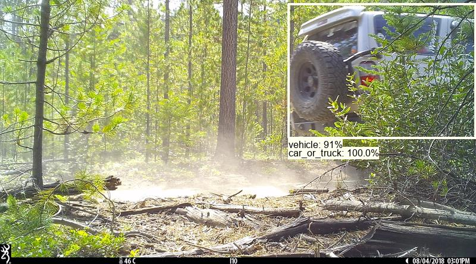
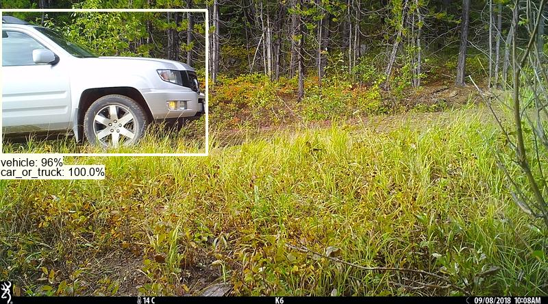
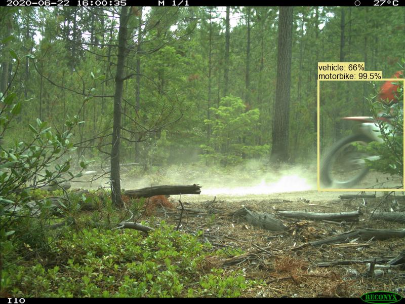
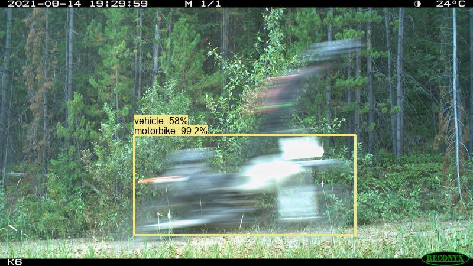
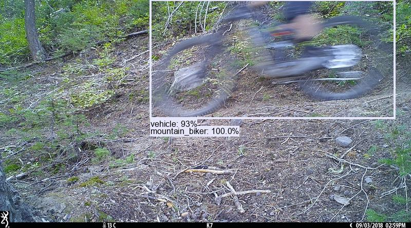
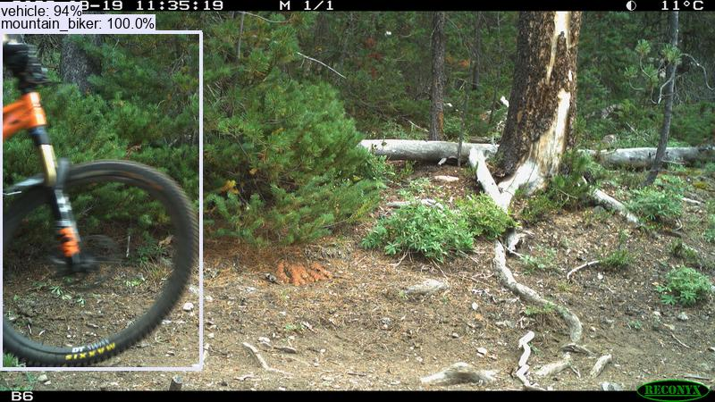
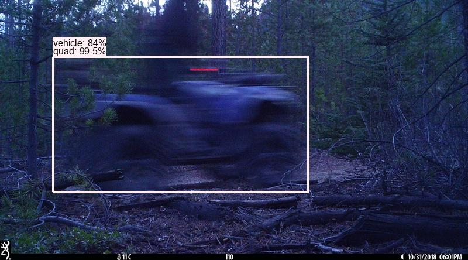
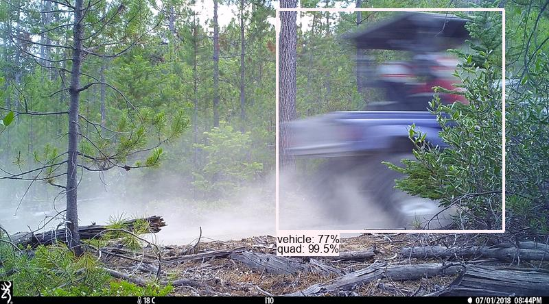

# Camera trap vehicle classifier

## Contents

* [Overview](#overview)  
* [Training data summary](#training-data-summary)  
* [Downloading the model](#downloading-the-model)  
* [Preparing images](#preparing-images) 
* [Environment setup](#environment-setup) 
* [Running the classifier](#running-the-classifier)  
* [Files in this repo](#files-in-this-repo)  
* [Sample images](#sample-images)  
* [Also see](#also-see)  

## Overview

The effects of human recreation on wildlife may vary depending on the type of road and trail use that is occurring (e.g. see [Naidoo and Burton, 2020](https://conbio.onlinelibrary.wiley.com/doi/full/10.1111/csp2.271)).  Classifying human and vehicle detections into finer sub-classes (e.g., car/truck, horseback rider, mountain biker) facilitates the study of how different types of recreational activities impact the distribution and abundance of wildlife. 

This repo hosts the training and inference code for a PyTorch model that classifies vehicles cropped from camera trap images (typically cropped with [MegaDetector](https://github.com/agentmorris/MegaDetector)) into the following categories:

* car/truck
* motorbike
* mountain bike
* quad

Sample images are provided in the <a href="#sample-images">sample images</a> section below.

This classifier is typically used in an ensemble with [SpeciesNet](https://github.com/google/cameratrapai), which also allows us to identify domestic dogs and horses, which complements the picture of recreational area use provided by the vehicle classifications.

The current release is fine-tuned from the [timm/eva02_large_patch14_448.mim_m38m_ft_in22k_in1k](https://huggingface.co/timm/eva02_large_patch14_448.mim_m38m_ft_in22k_in1k) base model.


## Training data summary

The training data for this model consists of ~200k vehicle crops extracted from ~300k images from 65 camera locations in British Columbia.  Training data was provided by [Robin Naidoo](https://www.worldwildlife.org/experts/robin-naidoo), World Wildlife Fund.


## Downloading the model

Download the model zipfile from the [releases page](https://github.com/agentmorris/camera-trap-vehicle-classifier/releases) and extract locally.  It contains a checkpoint file (camera-trap-vehicle-classifier.2025.07.09.ckpt) and the class list file (classes.txt).


## Preparing images

The inference script in this repo assumes that you have created a folder with cropped images; I typically do that with the [create_crop_folder](https://megadetector.readthedocs.io/en/latest/postprocessing.html#module-megadetector.postprocessing.create_crop_folder) module in the [MegaDetector Python package](https://pypi.org/project/megadetector/).


## Environment setup

Clone the repo, e.g. to c:\git\camera-trap-vehicle-classifier:

```bash
mkdir c:\git
cd c:\git
git clone https://github.com/agentmorris/camera-trap-vehicle-classifier
cd camera-trap-vehicle-classifier
```

Create a Python environment and install dependencies, e.g. with Anaconda:

```bash
conda create -n camera-trap-vehicle-classifier python=3.11 pip -y
conda activate camera-trap-vehicle-classifier
pip install -r requirements.txt
```

If you are on Windows and you have a GPU, you may have to also install the GPU version of PyTorch:

`pip install torch torchvision --upgrade --force-reinstall --index-url https://download.pytorch.org/whl/cu118`


## Running the classifier

`python run_vehicle_classifier [checkpoint_path] [image_dir] --output [output_file] --classes [class_name_file]`

...where:

* `checkpoint_path` is the path to the .ckpt file you extracted from the zipfile
* `image_dir` is your image folder (this will be processed recursively)
* `output_file` is the .json file to which you want to write results
* `class_name_file` is the location of the classes.txt file you extracted from the zipfile


## Files in this repo

### train_vehicle_classifier.py

PyTorch Lightning script for fine-tuning vision models for vehicle classification.

Supports timm and Hugging Face models.

Input data is provided as:

* A root image path
* A COCO .json file containing relative filenames within that root path, with a "split" field in each
  image set to either "train" or "val.


### train_vehicle_classifier_2025.07.02.py

Notebook that drives train_vehicle_classifier to train the actual classifier.

Also:

* Runs the classifier on the val crops and previews the results
* Creates a val folder of whole images


### run_vehicle_classifier.py

Inference script for PyTorch Lightning models trained with train_vehicle_classifier.py.
Runs inference on a folder, producing a .json file in the MegaDetector batch output format
(https://lila.science/megadetector-output-format).

Relies on train_vehicle_classifier.py for core classes.


## Sample images

These images are included here to capture the gestalt of what this classifier is trained on.  The classifier is trained only on the cropped vehicles, not on the entire images.  These are visualizations of the classifier output on the original images.  Image credit Robin Naidoo, World Wildlife Fund.

### car/truck




### motorbike




### mountain bike




### quad





## Also see

* This model is also available in the [Animl](https://animl.camera/) platform.
